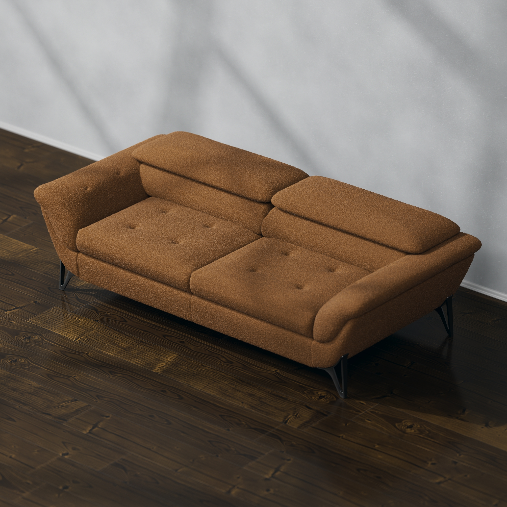
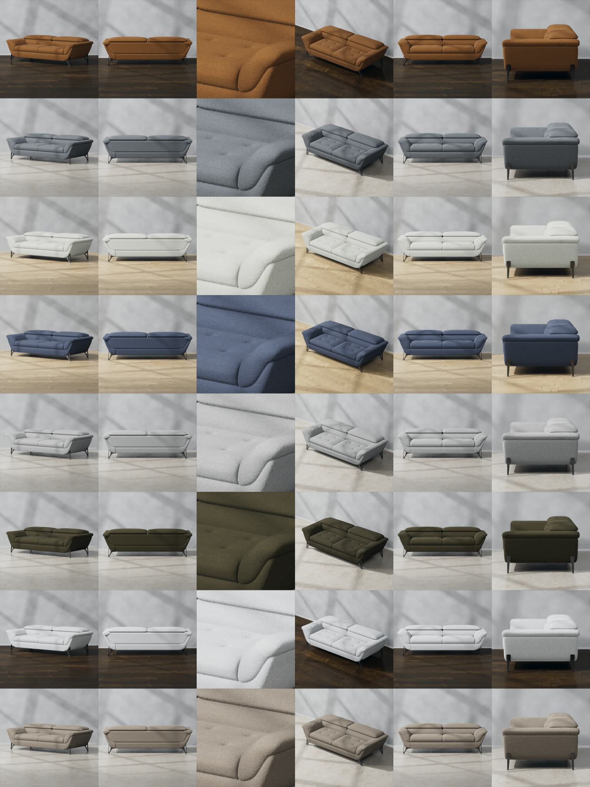
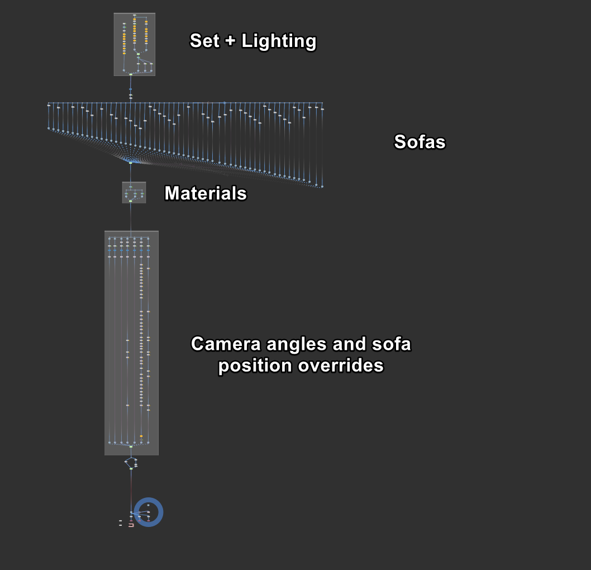
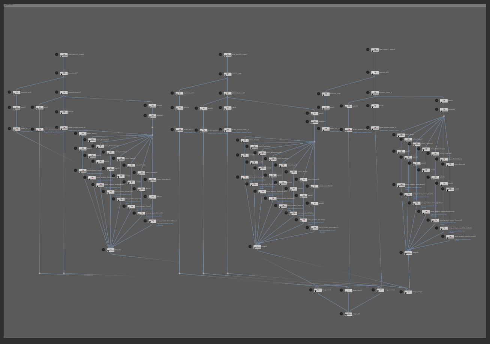
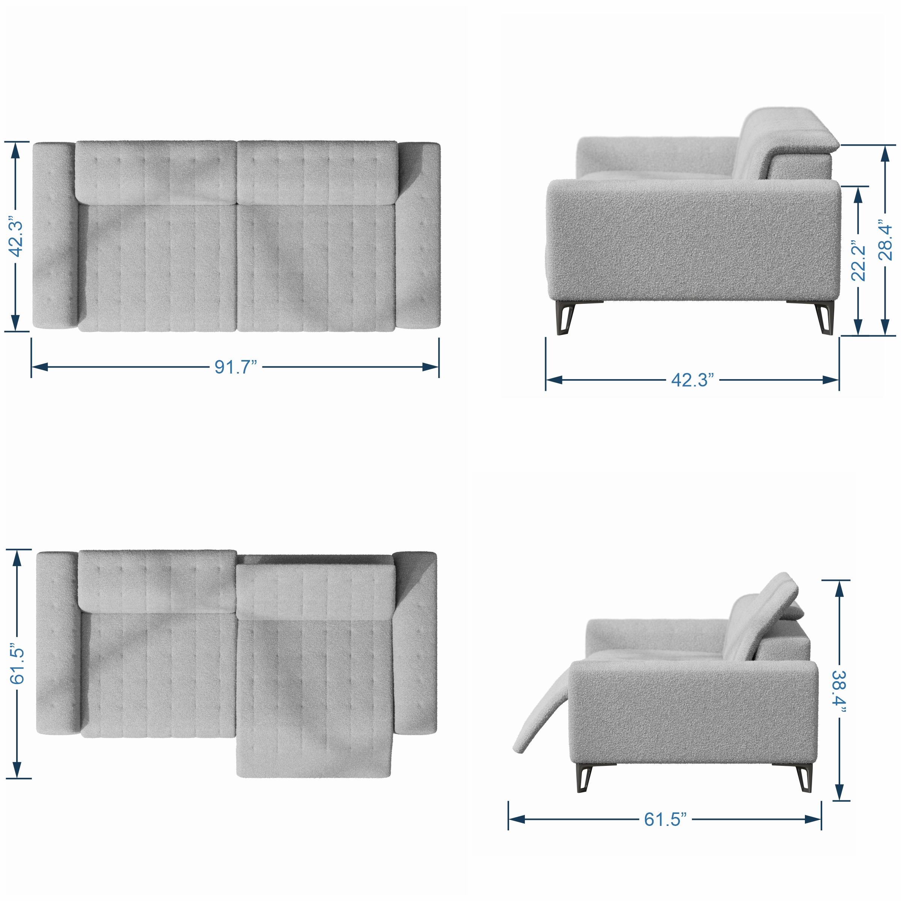

    Client requested high quality images for whole line of sofas.

    Each sofa needed multiple variations. In total 28(sofas) * 15(colors) * 6(angles) = 2520 images.
    Some sofas also required different variations to show how mechanism works.

    Usually these renders would be a big and complicated task, 
    but using Houdini Solaris I was able to build a system that was easy to manage 
    and make any adjustments for any particular sofa/angle/color configuration.

    I had to rebuild low quality CAD models into high resolution meshes 
    by using different workflows(remeshing, retopology, VDB conversion and vellum simulation).

    I build a  system to automatically assemble scene and center camera 
    around sofa with proper parameters for each camera angle. 

    With this setup I was able to output properly organized and named files.

    I was able to optimize render times by rendering unique part of the image only once and combining all parts in compositing.

Here are sofas with the same color and angle:

 Let's look at few angles for single sofa in full resolution: 

 Here are all possible variations for single sofa: 

Example of switching between different models, camera angles and sets: 

<video width="690" height="690" controls>
    <source src="../assets/images/portfolio/31_sofas/houdini_Variations.mp4" class="zoomportfolio img-fluid" alt="">
</video>

Houdini Stage, this is where whole scene is setup:

Houdini Comp, final image assembly happens here: 

Houdini TOPs, this is used to automate renders and comp jobs:

I also rendered top view for each sofa, so that it can be used in dimensions image: 

