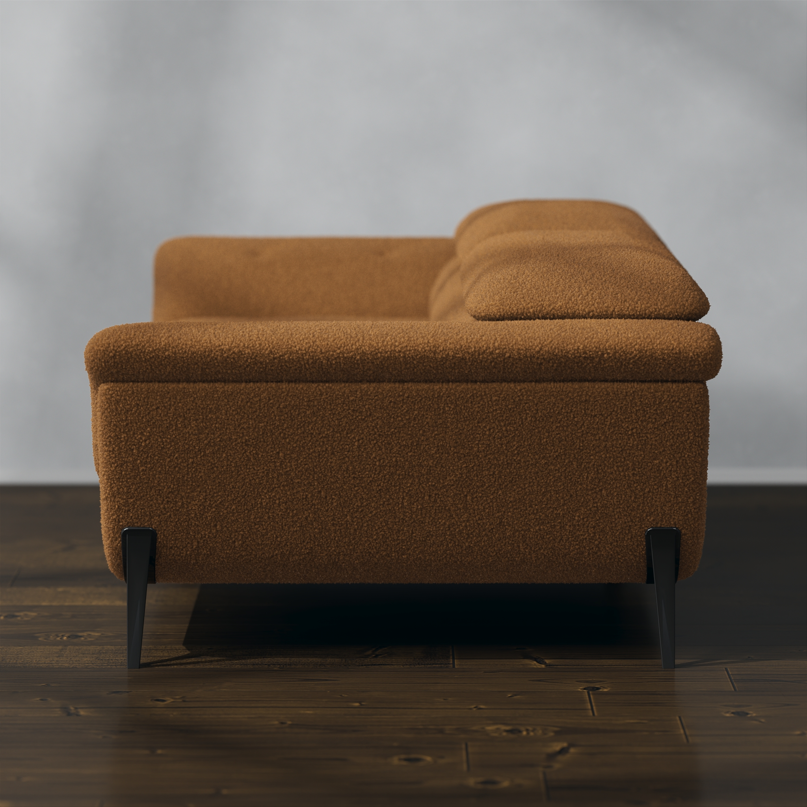
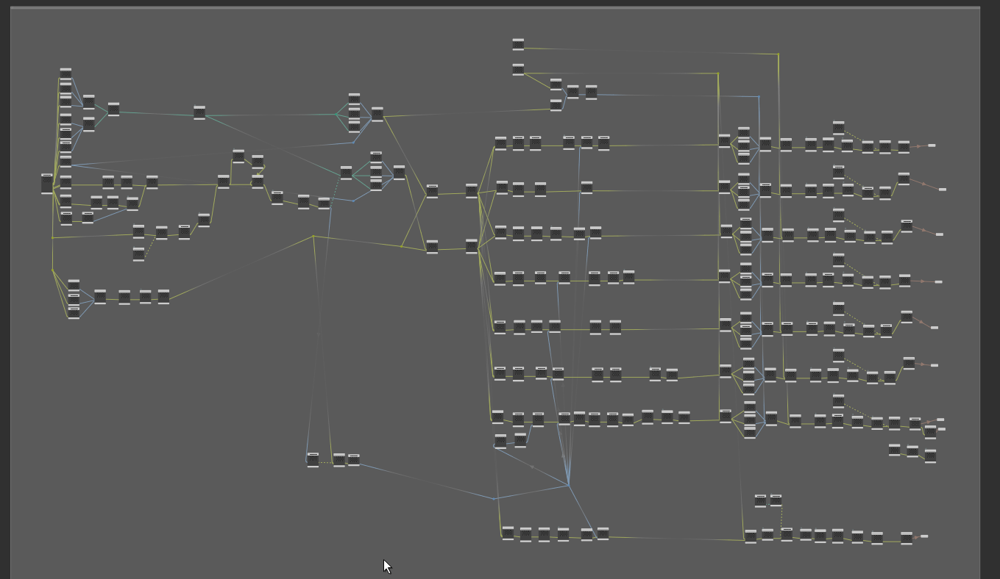

Client requested high quality images for whole line of sofas.

In some cases I had to rebuild low quality CAD models into high resolution meshes by using different workflows(remeshing, retopology, VDB conversion and vellum simulation). 
Each sofa needed multiple variations. In total 28(sofas) * 15(colors) * 6(angles) = 2520 images. 
 
Some sofas also required different variations to show how mechanism works.

Here is preview for some sofas in the same color and angle:

 Let's look at few angles for single sofa: 

 And now let's looks at all possible variations for single sofa: 

Usually these renders would be a big and complicated task, but using Houdini Solaris I was able to build a system that was easy to manage and make any adjustments for any particular sofa/angle/color configuration. I also build a simple system to automatically assemble scene and center camera around sofa with proper parameters for each camera angle. 

Here is example of me switching between different models, camera agles and sets:
 
<video width="690" height="690" controls>
    <source src="../assets/images/portfolio/31_sofas/houdini_Variations.mp4" class="zoomportfolio img-fluid" alt="">
</video>

Here is stage preview:

Here is TOPs, where I would setup all required renders:

Finally here is comp setup for final image assembly: 

I was able to optimize render times by rendering unique part of the image only once and combining all parts in compositing.

With this setup I was able to output properly organized and named files.

In addition to all this, I also rendered top view for each sofa, so that it can be used in dimensions image: 

