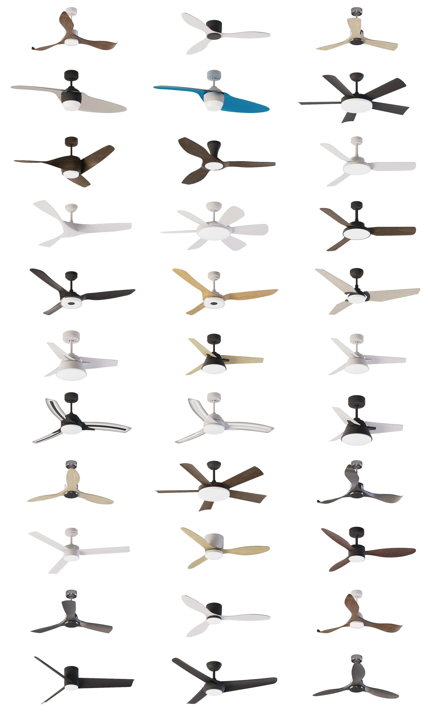

    Client requested high quality videos of rotating fans.

    Fans needed multiple variations. Different materials for body and blade. Including light on/off options. In total some fans required up to 24 variations.

    Using Houdini Solaris I was able to build a system that was easy to manage 
    and make any adjustments for any particular fan/material configuration.

    I had to rebuild low quality CAD models into high resolution meshes 
    by using different workflows(remeshing, retopology, VDB conversion).

    I build a system to automatically assemble scene and position fan and camera correctly. Renders where separated into different layers. Compositing and FFmpeg conversion to .mov files was also done in Houdini.

    With this setup I was able to automate repetitive tasks and schedule render --> comp --> movie all in TOPs.

Here are some fans:

Here is single fan animation: 

<video width="690" height="313" autoplay loop muted>
    <source src="../assets/images/portfolio/32_fans/single_fan_preview.mp4" class="zoomportfolio img-fluid" alt="">
</video>

Houdini Stage, this is where whole scene is setup:

Houdini Comp, final image assembly happens here: 

Houdini TOPs, this is used to automate renders and comp jobs:

